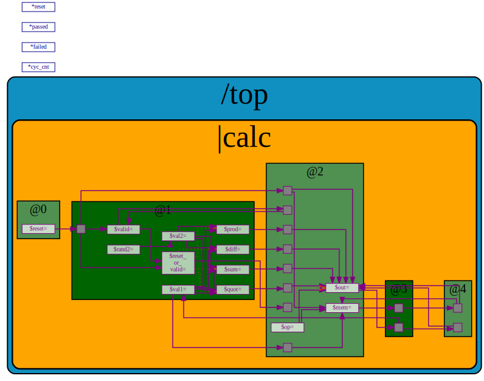

# RISC-V_MYTH_Workshop

For students of ["Microprocessor for You in Thirty Hours/THree weeks" (MYTH) Workshop](https://www.vlsisystemdesign.com/riscv-based-myth/), offered by [Redwood EDA](https://www.redwoodeda.com/) and training partners [VLSI System Design (VSD)](https://www.vlsisystemdesign.com/) and [The EEView](https://theeeview.com). Find here accompanying live info and links for "Day 3" - "Day 5" (which may not correspond to actual days, depending on the delivery format).

## About the Workshop

This workshop has recieved a great deal of attention in the RISC-V community for enabling students to learn at a pace never before possible through the use of TL-Verilog and [Makerchip](https://makerchip.com). Some links:
  - [Workshop info](https://www.vlsisystemdesign.com/vsd-iat/)
  - riscv.org blogs about [13-year-old Nicholas Sharkey](https://riscv.org/blog/2020/11/13-year-old-nicholas-sharkey-creates-a-risc-v-core/) and [12-year-old Niel Josiah](https://riscv.org/blog/2020/12/risc-v-microarchitecture-for-kids-steve-hoover-redwood-eda/)
  - [Linkedin posts](https://www.linkedin.com/search/results/all/?keywords=%23mythworkshop&origin=GLOBAL_SEARCH_HEADER)
  - [riscv.org's maintains a list of RISC-V cores, including MYTH cores](https://riscv.org/exchange/)

## Slack

You should have been invited to a Slack workspace for collaborative discussions.

  - If you have not already been added to the established Slack channels, request to be added.
  - Please introduce yourself in the appropriate channel.
  - Use the provided channels appropriately to ask questions throughout the workshop. Mentors monitor Slack nearly 24 hours/day throughout the workshop.
  - The search box at the top is your friend. Others may have encountered similar issues.

## VSD-IAT (for Day 1-2 content only, if included)

You should already be up and running with the [VLSI Design Systems - Intelligent Assessment Technology platform](https://vsdiat.com/). If you missed the live tutorial in the first call, the recording should have been posted in Slack, and you can search for it.

## GitHub Classroom Setup and Lab Submissions

Lab submissions begin on Day 2 and are done via GitHub Classroom. You should receive a link to join prior to Day 2. For this course, all interactions with your GitHub repository can be done from your browser. You can add files using the "Add File" dropdown menu. You can edit a text file by navigating to it and clicking the pencil icon. Live training is provided, and the recording should have been posted in Slack.

Submission process:

  - Day 2: We just want to see that you have done the work. Capture a few screenshots and save them in the `Day2` folder of your repository.
  - Day 3-5: Labs involving the calculator or RISC-V CPU should be submitted. If you miss a few, don't sweat it, but we want to see your progress. For each calculator or RISC-V lab:
    - Open your github classroom repository in your web browser.
    - Navigate into the `Day3_5` folder and the corresponding `calculator_solutions.tlv` or `risc-v_solutions.tlv`.
    - Click edit (pencil).
    - Paste your updated solution, *replacing* the existing code. (Within Makerchip editor select all (Ctrl-A) and copy (Ctrl-C), then select all in github editor (Ctrl-A) and paste with (Ctrl-V).)
    - Add commit message specifying the slide number or name of the lab, and commit changes.
    - (Do not *append* your changes, replace them entirely. you prior work is captured in the "History" (or "Commits").)

## Day 3-5 Slides

As you listen to videos and do the lab assignments, follow along in the slides. Comments have been added to address points of confusion.

  - [Day 3 Slides](https://drive.google.com/file/d/1ZcjLzg-53It4CO3jDLofiUPZJ485JZ_g/view?usp=sharing)
  - [Day 4 - 5 Slides](https://drive.google.com/file/d/1tqvXmFru31-tezDX30jTNJoLcQk308UM/view?usp=sharing)

## Labs Starting-Point Code

### Intro Labs (all that are not calculator or RISC-V)

No special starting point code is required.

Use [myth.makerchip.com](https://myth.makerchip.com).

### Calculator Labs

Begin with the following [starter code](https://myth.makerchip.com/sandbox?code_url=https:%2F%2Fraw.githubusercontent.com%2Fstevehoover%2FRISC-V_MYTH_Workshop%2Fmaster%2Fcalculator_shell.tlv) (Ctrl-click).

### RISC-V Labs

Begin with the following [starter code](https://myth.makerchip.com/sandbox?code_url=https:%2F%2Fraw.githubusercontent.com%2Fstevehoover%2FRISC-V_MYTH_Workshop%2Fmaster%2Frisc-v_shell.tlv) (Ctrl-click).

**Note** : As the complexity of your design increases, it might take long time (~3 mins) to generate the diagrams or they might fail to generate altogether.
This does **not** indicate a problem in your code. 

## HELP!!!

It's important to take your time with each concept and with each lab. Rushing ahead will slow you down in the end.

When you get stuck:

  1. Always check the LOG! Keep your log clean of errors (both SandPiper errors (blue) and Verilator errors (black)). In some cases we expect warnings (LOGIC_ERRORs) for signals that are "used but never assigned" where we want Makerchip to provide random input values. Common "Issues and Solutions" can be found below.
  1. Check the slide PDFs for any corrections, and check below for "Common Issues and Solutions".
  1. Review previous lectures.
  1. Follow conversation in Slack to see if someone else encountered similar issues.
  1. Explore these [reference solutions](https://myth.makerchip.com/sandbox?code_url=https:%2F%2Fraw.githubusercontent.com%2Fstevehoover%2FRISC-V_MYTH_Workshop%2Fmaster%2Freference_solutions.tlv) (Ctrl-click).
  
     No, we're not giving away the answers! This link will open in Makerchip the diagram, waveform, and visualization for the solution, but will not show source code. Explore these to figure out the issue that's plaguing you, and then go back to doing the lab on your own. If you are stuck on syntax, hover over a signal assignment in the diagram to see an expression.

     **Note** : Last time we conducted this workshop, students relied to heavily on reference solutions. This **slowed them down** . Furthermore, there are intentional bugs in the reference solutions, and we can easily tell if you are simply copying them.

     Note that you have to comment the line with `m4_define(['M4_CALCULATOR'], 1)` to see solutions for RISC-V Labs. 
  
     Also, we've pre-generated a Diagram of the final RISC-V reference solution at the bottom of this README.

  1. Share your sandbox URL with a mentor via Direct Message in Slack. (Be sure it is saved/cloned, and clone again before editing.)
  1. We have a Zoom plugin in Slack. Feel free to request a meeting with the instructors, or meet with others. Start a meeting with:
  
     `/zoom meeting My topic`

## Common Issues and Solutions

In some cases the viz logic will make error/warning messages a bit more obscure. If you have enabled visualization, try disabling it.

### SandPiper(TM) (blue log output)

### Verilator (black log output)

#### Verilated model didn't DC converge

Combinational logic loops back on itself so the combinational logic does not stabilize. Perhaps you missed a `>>1`.

Errors related to `[***NULL***:***NULL***]`: Disable viz macro and this error will most likely go away. Debug other SandPiper errors and re-enable viz.

## Pre-generated Diagram

Your generated CPU would look like this after implementing all labs.

**Note** : As noted above in "HELP!!!" section, refer to this diagram only when stuck. Reverse-engineering this diagram will **not** help you finish faster, and we can tell whether you simply reverse-engineer it.

*Ctrl-click* to use your browser's zooming and to hover over assignment statements.

## After the Workshop

### Show off your work!

GitHub is the new resume. Show off your work to the world. Many former students have developed impressive READMEs for their repositories, and even developed additional features for their cores to showcase what they learned, to further explore the technology, and to contribute the the community. If you have something unique to share about your experience in the workshop and the core you have built, we would be happy to showcase it from [RISC-V International's list of RISC-V Cores](https://riscv.org/exchange/) by adding it to [this list](https://github.com/stevehoover/RISC-V_MYTH_Workshop/blob/master/student_projects.md). Just [let us know](mailto:steve.hoover@redwoodeda.com).

If you choose to make your workshop repository public, follow these steps:

  1. Go to repository ('risc-v-myth-workshop-<date>-<yourname>') on Github.
  2. Click on the 'Settings' in top ribbon (below repo name).
  3. Scroll down to the bottom, in 'Danger Zone', click 'Change visibility'.
  4. In the window that opens, select "Make public", type the given text, and click "I understand ....".
  5. Done! You can use private mode (in firefox) or incognito (in chrome) to visit the repo and see how it would look like to the world.
  6. Optionally, you can change the repository name. If you have any clones of your repository, you'll want to push changes and delete them first.
